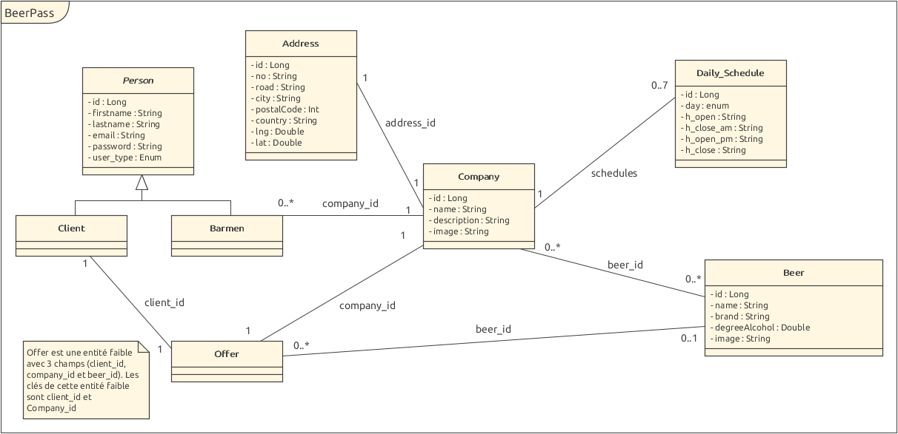
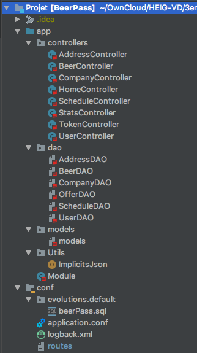
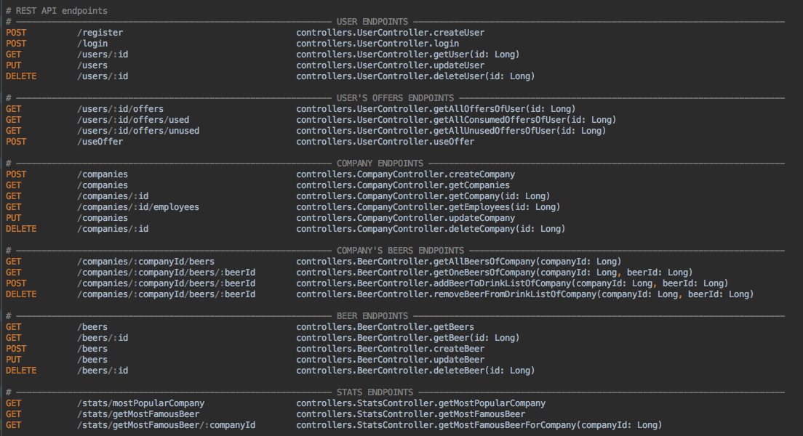

# Rapport projet Scala - BeerPass:

Membres du groupe: Antoine Rochat et Benoît Schopfer

## Description du projet:

Le Beer Pass vous permet d'obtenir une bière gratuite dans tous les établissements partenaires (+100 établissements) sur une année civile. Le prix du pass serait de 49 CHF par année.

Une fois le Beer Pass commandé, les utilisateurs pourront consulter les bons disponibles sur l'application smartphone dédiée. Ils pourront faire valoir leurs offres dans les différents établissements partenaires grâce à un QR Code généré automatiquement par l'application.

Ce projet permettrait aux utilisateurs de découvrir de nouveaux établissements (bars ou brasseries) dans leur région et ceci à un prix attractif.

L'attrait pour les établissements est double. Une telle application leur permettrait de se faire connaître par de nouveaux clients mais aurait également un interêt financier direct. En effet, il a été prouvé que les clients consommaient davantage ou passaient commande dans les différents établissements où ils ont fait valoir un bon.

## Technologies utilisées:

Pour ce projet, nous avons utilisé:

- Scala pour écrire le Backend (une API REST).
- Slick pour faire le lien entre la base de données et le backend.
- React Native et Expo pour créer le Frontend (une application smartphone), qui permet:
  - Pour les utilisateurs : 
    - De consulter les bons disponibles
    - De consulter les bons utilisés
    - De faire valoir un bon en générant un QR Code qui sera scanné par l'établissement partenaire.
    - De consulter des statistiques (bière la plus vendue et établissement le plus fréquenté)
  - Pour les établissements :
    - De scanner les QR Code des utilisateurs afin de valider leurs commandes.
    - De consulter des statistiques (bière la plus vendue et établissement le plus fréquenté)

## Description de l'implémentation:

### Base de données:

La modélisation de notre base de données est la suivante:



Un script SQL est disponible dans le dossier conf/evolution.default/beerPass.sql afin de créer les tables et populer notre base de données avec quelques données de tests.

L'url de connexion (*DB_URL*), l'utilisateur (*DB_USER*) et le mot de passe (*DB_PWD*) sont à définir en temps que variable d'environnement ou en utilisant les mêmes données que ci-dessous:

```
slick.dbs.default.profile = "slick.jdbc.MySQLProfile$"
slick.dbs.default.db.driver = "com.mysql.cj.jdbc.Driver"
slick.dbs.default.db.url = "jdbc:mysql://localhost:3306/beerPass"
slick.dbs.default.db.user = "beerPass"
slick.dbs.default.db.password = "beerPass"

// Env variables
slick.dbs.default.db.url = ${?DB_URL}
slick.dbs.default.db.user = ${?DB_USER}
slick.dbs.default.db.password = ${?DB_PWD}
```

### Backend:

#### Architecture générale:

L'architecture de notre backend est très simple et suit un modèle MVC. Cependant, notre backend n'offre aucune vue. En effet, il ne fait que retourner du JSON mais n'affiche jamais de pages HTML ou autre.



##### Models:

Comme vous pouvez le voir dans la capture ci-dessus, nos modèles se trouvent dans le fichier models du dossier du même nom. Ce fichier contient toutes les case class représentant les objets d'une entrée d'une table de la base de données. Cependant, nous avons plus de modèles dans ce fichier que de tables dans notre base de données car nous utilisons certains de ces modèles pour représenter des objets que nous manipulons dans notre code scala. Par exemple, la case class *Offer* représente la table OFFER de notre base de données, alors que la case class *OfferWithObjects* n'en représente aucune.  *OfferWithObjects* est en fait une représentation contenant tout les objets attachés (via une foreignKey) à une *Offer* (qui ne contient que leurs ids). Il en va de même pour la case class *CompanyWithObjects* représentant une *Company* avec l'ensemble de ses objets attachés.

##### Controllers:

Les contrôleurs gèrent chacune une ou plusieurs des routes proposées par notre API. Dans notre backend, nous avons regroupé dans un même contrôleur toutes les routes agissant avec la même table de notre base de donnée. 

Par exemple, toute les routes permettant d'interagir avec une company sont gérées dans le contrôleur *CompanyController*. Ce contrôleur fait lui-même appel à d'autres contrôleurs tels que *AddressController* ou *ScheduleController* pour gérer les horaires et l'adresse d'une company.

Les contrôleurs ne font pas directement les appels à la base de données. En effet, ceux-ci sont fait dans les DAOs que nous décrivons par la suite.

Une requête reçue sur notre API va donc être redirigées vers la méthode du contrôleur adéquat (selon les règles de routage décrites dans le fichier *route*). Cette méthode va effectuer les actions demandées en faisant appel aux DAOs nécessaires, puis déterminera la réponse à retourner en fonction du déroulement des opérations.

Dans le cas de notre API, les retours des contrôleurs sont toujours des objets JSON encapsulés dans des réponses HTTP (Ok, BadRequest, NotFound, …)

##### DAOs:

Les DAOs gèrent les appels à la base de données. Dans notre API, nous avons utilisé Slick afin de pouvoir écrire nos requêtes SQL directement en Scala. 

Nos DAOs sont découpées en 2 parties. Un trait définissant un component (ex: *CompanyComponent*), ainsi que la DAO héritant de ce trait.

Dans le Component, nous déclarons la table (ex: *CompanyTable*) permettant de convertir un objet Scala en une ligne de la table *COMPANY* de notre base de données et inversement. Nous déclarons également un TableQuery de cette table que nous utiliserons par la suite dans nos DAOs pour interagir avec la table de la base de données.

Dans la DAO (ex: *CompanyDAO*), nous définissons une méthode pour chaque appel à la base de données que nous souhaitons effectuer. Par exemple, la méthode *findById(id: Long)* de notre *CompanyDAO* permet de récupérer dans la base de données la company correspondant à l'id reçu en paramètre, *insert(company: Company)* permet d'ajouter une nouvelle company dans la base de données etc.

Dans ces méthodes, les appels à la base de données sont écrit en Scala et non pas en SQL. Nous avons pu faire cela grâce à l'utilisation de Slick. C'est donc grâce à Slick que nous pouvons écrire la requête suivante, permettant de récupérer la company correspondant à l'id reçu en paramètre : 

```Scala
def findById(id: Long): Future[Option[CompanyWithObjects]] = {
    val query = for {
      company <- companies if company.id === id
      address <- company.address
    } yield (company, address)

    db.run(query.result.headOption)
      .map(option => option
        .map(tuple => CompanyWithObjects
          .fromCompany(tuple._1, tuple._2, Some(Await.result(scheduleDAO.findAllDailySchedulesFromCompanyId(tuple._1.id.get), Duration.Inf)))))
}
```


En général, comme pour les contrôleurs, une DAO regroupe l'ensemble des requêtes concernant une table de notre base de données. Cependant, certaines de nos DAO utilisent plusieurs tables, tel que *ScheduleDAO*., qui utilise la table *DAILY_SCHEDULE* et la table *LINK_DAILY_SCHEDULE_COMPANY*.

Nous avons fait cela car ces deux tables sont intimement liées puisque la table *LINK_DAILY_SCHEDULE_COMPANY* est une table de liaison nécessaire pour enregistrer une relation 1-N en MySQL. Ainsi, demander à récupérer tous les horaires d'une company se fait très simplement en appelant la méthode *findAllDailySchedulesFromCompanyId(companyId: Long)*.

##### Routes:

Notre backend propose une API REST avec les routes suivantes:

Nous pouvons effectuer un CRUD sur les company, les users et les bières. Nous pouvons également récupérer et utiliser les offres d'un client ou encore lire quelques statistiques.

### Problèmes rencontrés:

Les principaux problèmes rencontrés ont été causés par Slick!

Tout d'abord, il a été passablement ardu de trouver des exemples de codes quelque peu développés et fonctionnels pour Slick!
En effet, l'exemple qui nous avait été fourni ne montrait pas l'utilisation des foreignKeys et les tables étaient très basiques (pas de relations n-n ou 1-n etc)! Malheureusement, la très grande majorité des exemples Slick disponibles sur internet sont tout aussi basiques voir plus simples encore!

Nous avons donc rencontré des difficultés pour réussir à faire fonctionner les foreignKeys. Difficulté que nous avons finalement pu surmonter avec l'aide de la prof et des assistants qui ont complexifié l'exemple pour nous montrer comment faire fonctionner les foreignKeys.

Par la suite, nous avons rencontré des difficultés à faire fonctionner les Enumérations. Plus précisément, il a été compliqué de faire en sorte que Slick également utilise une Enum (comme disponible en MySQL) et non un champ texte.

Finalement, et c'est sans doute ce qui a terminé de nous dégouter de Slick, il s'est avéré impossible d'ajouter des données dans une table ne possédant pas de champ en AutoInc! Or, selon notre modélisation, la table *LINK_DAILY_SCHEDULE_COMPANY* devrait posséder deux clés primaires (CompanyId et dailyScheduleId) qui sont également deux foreignKeys. Elle ne devrait pas posséder de champ en AutoInc! Mais comme nous n'avons pas pu trouver d'exemples fonctionnels sur internet et ne sommes pas parvenu à régler ce problème, nous avons été obligés d'ajouter une clé primaire *id* en autoInc afin que Slick soit heureux. Ce champ est donc enregistré dans notre base de données alors qu'il nous sert en réalité à rien du tout!

 

### Amélioration possibles:

De nombreuses améliorations pourraient encore être apportées à notre projet!

Au niveau du Backend, la principale amélioration qu'il faudrait apporter avant une mise en production serait la sécurité! En effet, nous n'avons réalisé qu'un Proof Of Concept. Nous avons mis en place un système de login, mais aucun de nos endpoints ne sont protégés! Autrement dit, n'importe qui peut faire n'importe quoi, rien n'est contrôlé!

D'autres améliorations sont possible, tel que trouver comment faire marcher Slick pour supprimer l'id inutile dans la table *LINK_DAILY_SCHEDULE_COMPANY*, comme expliqué précédemment.

On pourrait également ajouter de nouvelles statistiques un peu plus poussées.

Mais le gros des améliorations seraient à apporter à l'application directement. En effet, l'application ne propose que quelques fonctionnalités très simples. Le Backend permet de faire bien plus. Par exemple, l'application pourrait proposer au client de modifier ses informations, ou bien de consulter la liste de boissons proposées par un établissement…. On pourrait aussi proposer aux employés d'ajouter / enlever / modifier la liste des boissons proposées par l'établissement directement depuis l'application…

Toutes ses fonctionnalités sont disponibles au niveau du Backend, mais nous n'avons pas eu le temps de les implémenter au niveau de l'application smartphone.